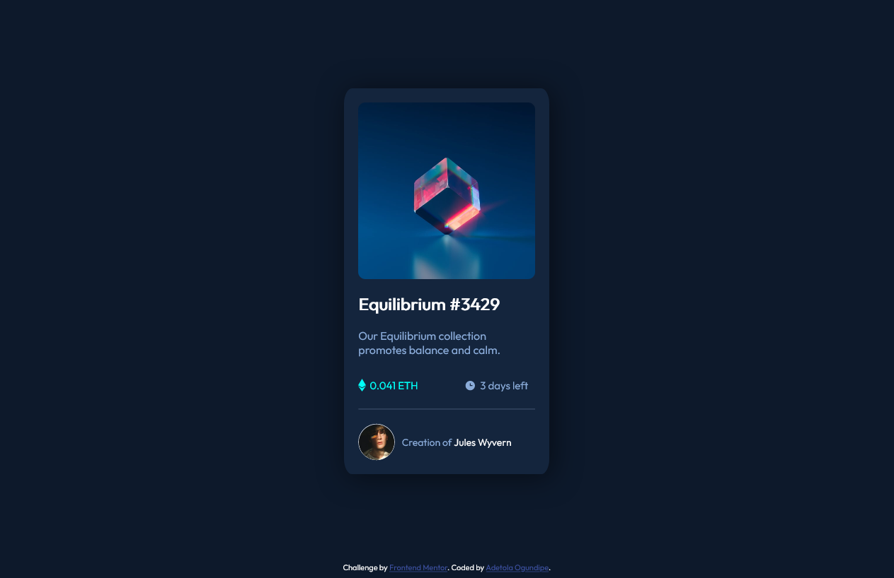

# Frontend Mentor - NFT preview card component solution

This is a solution to the [NFT preview card component challenge on Frontend Mentor](https://www.frontendmentor.io/challenges/nft-preview-card-component-SbdUL_w0U). Frontend Mentor challenges help you improve your coding skills by building realistic projects. 

## Table of contents

- [Overview](#overview)
  - [The challenge](#the-challenge)
  - [Screenshot](#screenshot)
  - [Links](#links)
- [My process](#my-process)
  - [Built with](#built-with)
  - [What I learned](#what-i-learned)
  - [Continued development](#continued-development)
  - [Useful resources](#useful-resources)
- [Author](#author)

## Overview

### The challenge

Users should be able to:

- View the optimal layout depending on their device's screen size
- See hover states for interactive elements

### Screenshot



### Links

- Solution URL: [View Solution here](https://github.com/tolaogundipe/Frontend-Mentor---NFT-preview-card-component-solution)
- Live Site URL: [View live site here](https://tola-ogundipe-nft-preview-card.netlify.app/)

## My process

### Built with

- Semantic HTML5 markup
- CSS custom properties
- Flexbox
- Mobile-first workflow


### What I learned

Use this section to recap over some of your major learnings while working through this project. Writing these out and providing code samples of areas you want to highlight is a great way to reinforce your own knowledge.

I was able to practice semantic HTML, CSS flex box, absolute and relative positioning, responsive units, CSS animations and CSS functions. I learned how to target a container for hover animation. I am particularly proud that i was able to deliver this design optimised for both mobile and desktop without using media queries.
 
I am proud of the following lines of code:

```css
.container {
  padding: clamp(10px, 20px, 25px);
}
.card-header:hover .card-header-overlay{
  /* code here */
  /* being able to select the div that contained the icon that displayed on hover */
}
```

### Continued development

My focus for the future is to practice more CSS positioning, CSS animations and CSS selectors 

### Useful resources

- [W3Schools - How to make an image overlay icon](https://www.w3schools.com/howto/howto_css_image_overlay_icon.asp) - This helped me figure out how to make the image overlay work like it should.
- [W3Schools CSS Positioning](https://www.w3schools.com/cssref/pr_class_position.asp) - This is an amazing article which helped me finally understand CSS positioning. I'd recommend it to anyone still learning this concept.

## Author

- Website - [Adetola Ogundipe](https://www.your-site.com)
- Frontend Mentor - [@tolaogundipe](https://www.frontendmentor.io/profile/tolaogundipe)


